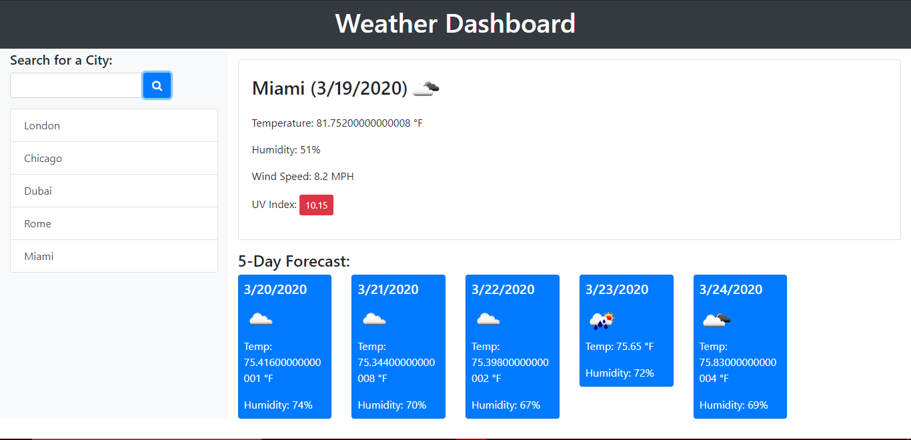

# Weather_Dashboard

Using the Weather Dashboard, users can look up the current forecast of any given city as well as a five-day forecast below. Users will be able to view the current temperature in fahrenheit, current humidity levels, wind speed and ultra-violet index.

After selecting a city, the user will be able to view any past searches on the left side of the screen underneth the search bar.

This app uses the OpenWeather API to determine all the weather information that is displayed on each card on the screen. The app is also responsive on most mobile devices.

# How It Works

Right above is what the user views about visiting the application.

# Future Updates

One of the updates I'm currently working on is adding a remove feature that will allow the user to remove a city from their list if they no longer want or need the information. Another update in mind is fixing the temperature decimal problem. While the temperature is displaying fahrenheit, it is currently display a large decimal number.

Another update currently in the works in adding an option for the user to switch between both fahrenheit and celsius.